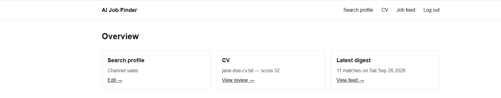

# AI Job Finder

Open-source, self-hostable job search agent: set up your search profile and CV once, get a ranked daily feed of
matches (plus a few wildcard surprises) with plain-English explanations, and get CV coaching before you apply.

See [`BUILD_SPEC.md`](BUILD_SPEC.md) for the full architecture: tech stack, data model, job sources, and agent
schedule.



## Quickstart (local dev)

Requires Node 20+ and Docker (for Postgres) — or point `DATABASE_URL` at any Postgres 14+ instance you already
have.

```bash
cp .env.example .env
# then edit .env: at minimum set JWT_SECRET and ANTHROPIC_API_KEY (or OPENAI_API_KEY
# + LLM_PROVIDER=openai) for CV parsing/review/tailoring and match scoring.
# OPENAI_API_KEY is optional — it only enables an embedding-based pre-filter
# before matching (Anthropic has no embeddings endpoint); without it, the app
# runs on Claude alone and scores the most recent postings directly.

docker compose up -d db          # Postgres on localhost:5433 (not 5432 — avoids clashing with a native Postgres install)
npm install
npm run db:migrate               # create tables
npm run dev                      # http://localhost:3000
```

Register an account in the UI, set up a search profile, upload a CV, then either wait for the nightly agents or
click **"Refresh matches now"** on the job feed page to score immediately.

To run the background agents locally without the full worker process:

```bash
npm run ingest    # fetch + upsert postings from all job sources
npm run digest    # score + compile + (optionally) email today's digest for every user
```

## Running everything with Docker

```bash
cp .env.example .env   # edit as above
docker compose up -d --build
```

This starts Postgres, the Next.js app (`http://localhost:3000`, runs migrations on boot), and a `worker`
container running the daily ingest/digest schedule (`src/worker/index.ts`).

## Deploying to Vercel

The hosted path, for when the people using it aren't on your network. The app is already built for it: a
`vercel-build` script runs migrations on every deploy, `vercel.json` schedules the daily agents with Vercel Cron
(no worker process needed), and CV files go to Vercel Blob (serverless functions have no persistent disk).

```bash
npx vercel link                                          # creates the project, connects the GitHub repo
npx vercel integration add neon                          # managed Postgres — sets DATABASE_URL + DATABASE_URL_UNPOOLED
npx vercel blob create-store <name> --access private --yes   # private CV storage — sets BLOB_READ_WRITE_TOKEN
npx vercel env add STORAGE_DRIVER production,preview --value vercel-blob --yes
npx vercel env add JWT_SECRET production,preview --value "$(openssl rand -hex 32)" --yes
npx vercel env add CRON_SECRET production,preview --value "$(openssl rand -hex 32)" --yes
npx vercel env add ANTHROPIC_API_KEY production,preview --value "sk-ant-..." --yes
npx vercel deploy --prod
```

After that, every push to `main` deploys automatically. Two things worth knowing:

- Neon gives you a **pooled** URL (`DATABASE_URL`, used by the app) and an **unpooled** one
  (`DATABASE_URL_UNPOOLED`, used by `prisma migrate`). Migrations need the unpooled one — PgBouncer's
  transaction pooling can't hold the session-level advisory lock Prisma takes, and a deploy that tries will hang
  until it times out. `prisma.config.ts` already prefers the unpooled URL when present.
- Vercel Cron sends `Authorization: Bearer $CRON_SECRET` on its own once that env var is set, so the
  `/api/cron/*` routes are protected out of the box. The Hobby plan allows exactly the two once-a-day crons this
  app uses.

## Project layout

```
prisma/schema.prisma      Data model (see BUILD_SPEC.md §3)
src/agents/                The actual "AI" — ingest, match, cvParse, cvReview, cvTailor, digest
src/agents/sources/         One file per job source (Remotive, Arbeitnow, RemoteOK, ...)
src/lib/                    Shared infra: db, llm, embeddings, storage, auth
src/app/api/                Route handlers (auth, profile, cv, jobs, cron)
src/app/(dashboard pages)   The UI
src/worker/                 node-cron scheduler + one-off CLI runner
```

## Configuration

Every environment variable is documented in [`.env.example`](.env.example). Notable ones:

- `LLM_PROVIDER` (`anthropic` | `openai`) + `LLM_MODEL` — swap providers without touching code.
- `STORAGE_DRIVER` (`local` | `vercel-blob` | `s3`) — CV files on local disk by default; `vercel-blob` for
  Vercel deployments (see above); `s3` is still a stub, see BUILD_SPEC.md §9.
- `RESEND_API_KEY` — optional; digests always generate in-app, email is a bonus.
- `CRON_SECRET` — required if you drive ingestion/digests via `/api/cron/*` (Vercel Cron, or any external
  scheduler) instead of `npm run worker`.

## Known dev-dependency advisories

`npm audit` currently reports a few high-severity advisories under Prisma's own CLI dev-tooling
(`@prisma/config`'s optional `mysql2`/`deepmerge-ts` chain, unrelated to our Postgres-only runtime). They're not
reachable from anything this app runs; re-check with `npm audit` after bumping `prisma`/`@prisma/client`.

## License

MIT — see [`LICENSE`](LICENSE).
